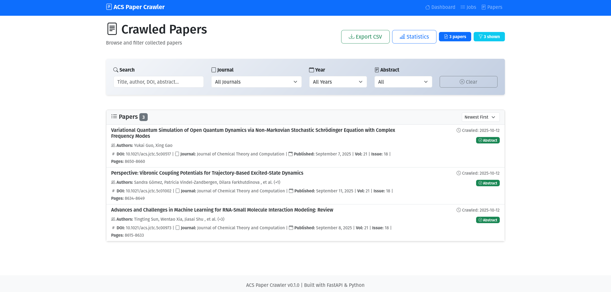
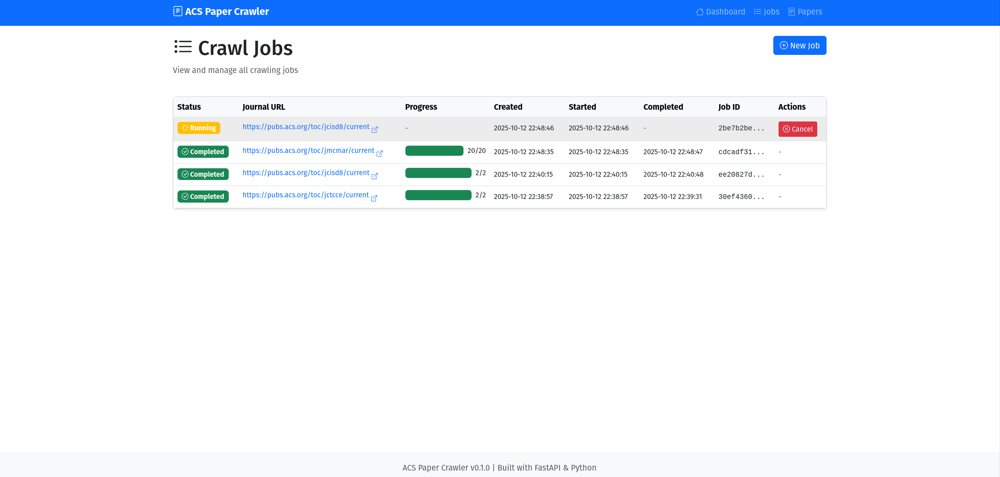

# ACS Paper Crawler / ACS 论文爬虫

[](https://www.python.org/downloads/)
[](https://fastapi.tiangolo.com/)
[](LICENSE)
[](docs/)

A professional web-based crawler for American Chemical Society (ACS) papers with modern dashboard and analytics.

专业的 ACS（美国化学会）论文网络爬虫，具有现代化仪表板和分析功能。

[English](#english) | [中文](#中文) | [📚 Documentation](docs/)

---

<a name="english"></a>

## English

### Features

- **43 Built-in Journals**: Pre-configured ACS journal list
- **Real-time Crawling**: Extract papers from ACS Publications
- **Complete Metadata**: Title, DOI, authors, abstract, keywords, citation info
- **Modern Dashboard**: Interactive charts and statistics
- **Advanced Filtering**: Search by title, author, journal, year
- **Background Jobs**: Async crawling with progress tracking
- **RESTful API**: Full API documentation at `/docs`

### Quick Start

```bash
# Install dependencies
pip install -r requirements.txt

# Run the application
python run.py

# Open browser
http://localhost:8000
```

### Requirements

- Python 3.9+
- Chrome browser
- ChromeDriver (auto-downloaded)

### Documentation

Full documentation available in the `docs/` directory:

```bash
cd docs
make html
# Open docs/_build/html/index.html
```

Or read online: [Documentation](docs/)

### Screenshots


*Dashboard with statistics and charts*


*Advanced paper filtering*


*Job management with cancellation*

### License & Copyright

**Copyright (c) 2025 ACS Paper Crawler Contributors**

This software is for **educational and research purposes only**.

- ✅ Academic & Educational Use
- ✅ Research & Study
- ❌ Commercial Use (requires permission)
- ⚠️ Respect ACS Terms of Service

See [LICENSE](LICENSE) and [full documentation](docs/) for details.

---

<a name="中文"></a>

## 中文

### 功能特性

- **43 个内置期刊**：预配置的 ACS 期刊列表
- **实时爬取**：从 ACS Publications 提取论文
- **完整元数据**：标题、DOI、作者、摘要、关键词、引用信息
- **现代化仪表板**：交互式图表和统计
- **高级过滤**：按标题、作者、期刊、年份搜索
- **后台任务**：异步爬取，进度追踪
- **RESTful API**：完整 API 文档位于 `/docs`

### 快速开始

```bash
# 安装依赖
pip install -r requirements.txt

# 运行应用
python run.py

# 打开浏览器
http://localhost:8000
```

### 环境要求

- Python 3.9+
- Chrome 浏览器
- ChromeDriver（自动下载）

### 文档

完整文档位于 `docs/` 目录：

```bash
cd docs
make html
# 打开 docs/_build/html/index.html
```

或在线阅读：[文档](docs/)

### 截图


*带统计和图表的仪表板*


*高级论文过滤*


*带取消功能的任务管理*

### 许可证与版权

**版权所有 (c) 2025 ACS Paper Crawler 贡献者**

本软件仅用于**教育和研究目的**。

- ✅ 学术与教育用途
- ✅ 研究与学习
- ❌ 商业用途（需要许可）
- ⚠️ 遵守 ACS 服务条款

详见[许可证](LICENSE)和[完整文档](docs/)。

---

## Project Structure / 项目结构

```
ACS_crawler/
├── src/acs_crawler/      # Source code / 源代码
├── docs/                 # Documentation / 文档
├── data/                 # Database / 数据库
├── logs/                 # Logs / 日志
├── run.py               # Entry point / 入口
└── README.md            # This file / 本文件
```

## Technology Stack / 技术栈

**Backend**: FastAPI, SQLite, Selenium, BeautifulSoup4
**Frontend**: Bootstrap 5, Chart.js, Vanilla JavaScript

---

## Contributing / 贡献

Contributions welcome! Please see [CONTRIBUTING.md](docs/CONTRIBUTING.md)

欢迎贡献！请查看[贡献指南](docs/CONTRIBUTING.md)

## Support / 支持

- 📚 [Documentation](docs/)
- 🐛 [Report Issues](https://github.com/your-repo/issues)
- 💬 [Discussions](https://github.com/your-repo/discussions)

---

**Happy Crawling! / 爬取愉快！** 🚀
